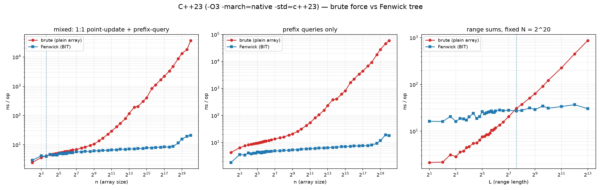
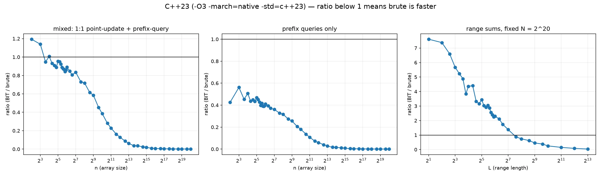
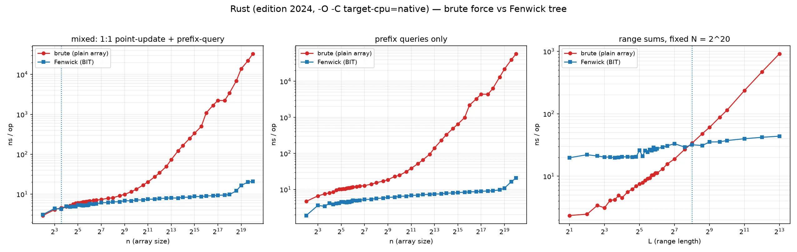
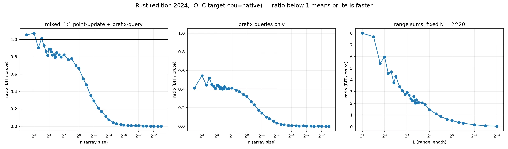
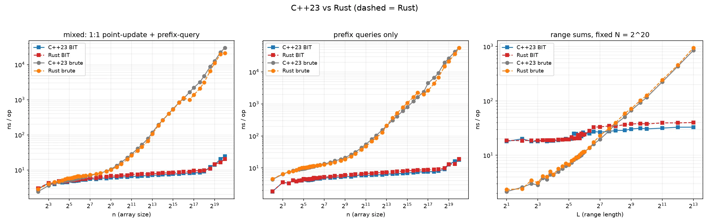

# 直接暴力 vs 树状数组（BIT）：临界点在哪

同一个数据集合（`u64`，单点修改 + 前缀和 / 区间和查询），对比两种实现，测量“在
多大的 n（或区间长度 L）时，直接暴力比树状数组快”：

- **brute（直接暴力）**：普通数组；修改 `a[i] += d` 是 O(1)；前缀和查询从
  `0` 循环加到 `i`，区间和查询从 `l` 循环到 `r`。源码就是普通 `for` 循环，
  不手写 intrinsics——编译后 GCC/LLVM 都会自动生成 `vpaddq ymm`（mm256）
  向量化扫描，见下方「汇编验证」。
- **BIT（树状数组）**：1-indexed `tree[1..n]`；修改和查询都是标准的
  `lowbit` 循环，O(log n)。

## 三种测量模式

| 模式 | 含义 | 横轴 |
| --- | --- | --- |
| `mixed` | 1:1 交错的单点修改 + 前缀和查询（最接近实际用法） | n（数组大小） |
| `query` | 只做前缀和查询，不做修改 | n（数组大小） |
| `range` | 固定 N=2^20 的数组，随机区间 `[l, l+L)` 求和 | L（区间长度） |

## 复现

```bash
nix develop            # gcc/rustc/python+matplotlib
make bench-all         # ./bench > results.csv (C++23) 然后 ./bench_rs > results_rs.csv (Rust)
make plot              # 重新测 + 生成 5 张图并输出临界点
```

编译/测量方法（与 `bsearch_bench` 一致）：

- C++23：`g++ -O3 -march=native -std=c++23`
- Rust：`rustc --edition=2024 -O -C target-cpu=native`（edition 2024）
- 固定单个 P-core：`taskset -c 0`；C++ 和 Rust 串行跑，避免抢核
- 每个方法先校准到约 3 ms/轮的查询数，再跑 9 轮取中位数
- 每个 n 测量前先用随机操作流交叉验证 brute 与 BIT 结果一致（不通过直接
  abort）
- 位置用 mt19937_64（C++）/ splitmix64 高 32 位（Rust）生成，避免 LCG 在
  2 的幂 n 上出现周期坏数据

## 汇编验证：普通循环已经被自动向量化

动手写 mm256 之前先看了 `-O3 -march=native`（C++23）和
`-O -C target-cpu=native`（Rust edition 2024）生成的汇编：

**C++（GCC 15.3）**：前缀/区间求和循环自动向量化为单 ymm 累加器，每轮 32 字节：

```asm
.L3:
	vpaddq	(%rax), %ymm0, %ymm0
	addq	$32, %rax
	cmpq	%rdx, %rax
	jne	.L3
	vextracti128	$0x1, %ymm0, %xmm1
	vpaddq	%xmm0, %xmm1, %xmm0
	vpsrldq	$8, %xmm0, %xmm1
	vpaddq	%xmm1, %xmm0, %xmm0
```

**Rust（LLVM）**：同样自动向量化，而且是 4 个 ymm 累加器，每轮 16 个 u64：

```asm
	vpaddq	(%rdi,%rax,8), %ymm0, %ymm0
	vpaddq	32(%rdi,%rax,8), %ymm1, %ymm1
	vpaddq	64(%rdi,%rax,8), %ymm2, %ymm2
	vpaddq	96(%rdi,%rax,8), %ymm3, %ymm3
```

既然普通循环的机器码已经是 mm256，就不需要手写 intrinsics。实测手写 4 累加器
mm256 版（`_mm256_loadu_si256` + `_mm256_add_epi64`）对比自动向量化版：

| 场景 | 手写 mm256 vs 普通循环 |
| --- | --- |
| mixed（n=4..768） | 慢 7–10%（每轮 hsum 和循环结构更差） |
| query | 基本持平（±2% 噪声） |
| range，L ≤ 64 | 快 3–5% |
| range，L ≥ 1024 | 慢 10–17% |

结论：保留普通循环源码，机器码即为 AVX2 mm256；BIT 侧也保持最直接的实现。

## 本机结果（i9-13950HX，g++ 15.3，rustc 1.94.1）

“临界点”指：`暴力赢的最后一个大小 / BIT 赢的第一个大小`（两者之间是临界带）。

| 模式 | C++23 | Rust edition 2024 |
| --- | ---: | ---: |
| mixed（1:1 修改+前缀和） | 暴力 ≤ 8 / BIT ≥ 12 | 暴力 ≤ 8 / BIT ≥ 12 |
| query（纯前缀和查询） | 无临界点：n ≥ 4 起 BIT 一直更快 | 无临界点：n ≥ 4 起 BIT 一直更快 |
| range（区间和，N=2^20） | 暴力 ≤ 128 / BIT ≥ 192 | 暴力 ≤ 192 / BIT ≥ 256 |

直观结论：

- **纯查询没有任何暴力空间**。BIT 前缀查询平均只要 `popcount(k)` 次依赖
  load（n=4 时平均 1.5 步），而暴力平均扫 n/2 个元素；n=4 起 BIT 就赢了。
- **一旦带修改，暴力靠 O(1) 更新在小 n 上翻身**：mixed 场景下 n ≤ 8 暴力
  整体更快，n ≥ 12 开始 BIT 更快。n=16 附近两条线只差 ~1%（BIT 的单步次数
  随 n 的二进制结构有跳变），所以更准确的说法是临界带 n ≈ 8–20。
- **区间和按长度分界**：L 在 128（C++）/ 192（Rust）以内时直接循环更快，
  再大就轮到 BIT（两次前缀和）赢；这个长度约等于 16–24 条 64B cache line。
- Rust 与 C++ 的临界点基本一致；Rust 的暴力循环在大 L 上与 C++ 接近
  （约 5–10% 慢，随运行波动），所以 range 临界点略靠后。mixed/query 两种
  语言逐点几乎重合。

图（WebP）：











原始数据：`results.csv`（C++23）、`results_rs.csv`（Rust）。
